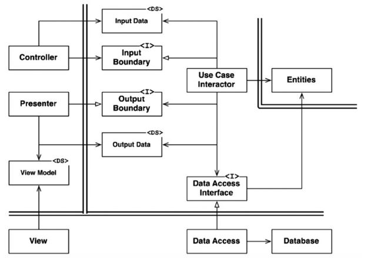

# golang-CleanArchitecture

Go 言語でクリーアーキテクチャを実現する場合の構成を作ってみる。

## 実行

```zsh
% git clone
% go version
go version go1.13.3 darwin/amd64
% export GO111MODULE=on
% go mod download
% go build -o app
% ./app server
% ./app server --type gin # ./app server -t gin
```

## 実装メモ

```zsh
% pwd # プロジェクトルートであることを確認
% export GO111MODULE=on
% go mod init
% go get -u github.com/spf13/cobra/cobra
% cobra init $(pwd)
Your Cobra application is ready at
$HOME/go/src/github.com/pepese/golang-CleanArchitecture

Give it a try by going there and running `go run main.go`.
Add commands to it by running `cobra add [cmdname]`.
```

コマンド作る。

```zsh
% cobra add server
```

実行する。

```zsh
% go build -o app
% ./app server # ./app server -t gin
% curl localhost:8080
Hello Go!
```

## 設計




勝手ながら各層に名前をつけて整理する。

- 第 1 層：青色：Frameworks & Drivers： **infrastructure** 層：外の世界とシステムを相互に繋ぐ層、最も具体的で詳細な実装、変更が多い
    - **server** ディレクトリ： FW に依存したリクエスト受信・返却の実装
        - view（HTMLとか）、api(JSONとかXML)
    - **batch** ディレクトリ：FW に依存したバッチ・ジョブの実装
- 第 2 層：緑色：interface Adapters： **interface** 層： infrastructure と usecase を相互に繋ぐ層
    - **controller** ディレクトリ：infrastructure からの呼び出しを usecase にマッピングする **handler** を実装する
	- **presenter** ディレクトリ：usecase層の実行結果をレスポンスを返却する形へ整形する
    - **gateway** ディレクトリ：datastore や httpclient のインターフェースとなるusecase層の **repository** インターフェースの実装
	    - **datastore** ディレクトリ：データベース製品に依存したアクセス、 repository の実装
		- **httpclient** ディレクトリ：他のマイクロサービスが外部サービスの API 呼び出し、 repository の実装
- 第 3 層：赤色：Applications Business Rules： **usecase** 層：アプリケーション独自のロジックを実装、domain 層のことだけ知っている（参照している）
    - interface 層より呼び出される
	- 1 つ以上のドメインモデルを操作・ドメインロジックを実行し、ビジネスロジックを成立させる
	- ビジネスロジックの結果を controller へ返却（ return ）する
- 第 4 層：黄色：Enterprise Business Rules： **domain** 層：最も抽象的な重要な実装、変更が少ない、他の層への参照が無く知らない
    - usecase 層によって扱われるドメインモデルとドメインロジック
    - ユースケースを実行するビジネスロジックは usecase 層に実装するが、ドメイン固有のルール・ロジックはここに実装する
	- **model** ディレクトリ
	    - ドメインモデルを入れる
- その他の層
    - **registry** ： DI とか
    - **cmd** ： cobra とかで作ったコマンド
    - **view** ： html template とか
    - **public** ： css とか js とか

今回は以下のようになった。

```
.
├── go.mod
├── go.sum
├── main.go
├─ cmd
│  ├─ root.go
│  └─ server.go
├─ infrastructure           # 第 1 層
│  ├─datastore
│  │  └─ hello_datastore.go
│  └─ server
│     ├─ gin.go
│     ├─ http.go
│     └─ util.go
├─ interface                # 第 2 層
│  ├─controller
│  │  ├─ gin_router.go
│  │  └─ http_router.go
│  └─ presenter
│     ├─ hello.go
│     └─ hello_repository.go
├─ usecase                  # 第 3 層
│  ├─ hello.go
│  ├─ hello_input.go
│  └─ hello_output.go
└─ domain                   # 第 4 層
   ├─ hello_logic.go
   └─ model
      └─ hello.go
```

```zsh
.
├── LICENSE
├── README.md
├── cmd
│   ├── root.go
│   └── server.go
├── domain
│   ├── hello_logic.go
│   └── model
│       └── hello.go
├── go.mod
├── go.sum
├── infrastructure
│   ├── datastore
│   │   └── hello_datastore.go
│   └── server
│       ├── ginserver.go
│       ├── httpserver.go
│       └── util.go
├── interface
│   ├── controller
│   │   ├── gin_router.go
│   │   └── http_router.go
│   └── presenter
│       └── hello_repository.go
├── main.go
├── usecase
│   └── hello_usecase.go
└── web
    └── registry
```

## 命名規則

- パッケージ名、ディレクトリ名
- ファイル名
- 関数、type、構造体
- レシーバ名
- 変数・引数名
- error変数名
- インターフェース名

### パッケージ名、ディレクトリ名

- 完結に、全て小文字かつ 1 単語で
  - 例外としては `_test` サフィックス
- utility パッケージにしない
  - base、util、common、lib、misc など
- パッケージ名を繰り返さない
  - `repository.UserRepository` とか NG
  - `list.NewList` でなく `list.New`
- どうしても難しい場合、ディレクトリ名はケバブケースは可
  - `xxx-xxx`

### ファイル名

- スネークケースで
  - `xxx_xxx`

### 関数、type、構造体

- キャメルケースで
  - 公開する場合はアッパーキャメルケース `XxxYyy`
  - 公開しない場合はローワーキャメルケース `xxxYyy`
- Getter/Setter
  - Go では所謂 Getter には `Get` プレフィックスを付けない
    - 例えば `User` を返したいなら、メソッド名は `GetUser` ではなく `User`
  - Setter の場合は SetUser のように `Set` を付ける
    -  (Go で Setter を作るケースはあまり無いけど)

### レシーバ名

Go には class は無いが、 **型に対してメソッドを定義** できる。  
構造体だけにメソッド定義できるのではなく、型に対して定義できることに注意。  
Go ではメソッドを定義する型を **レシーバ** と呼ぶ。

- 英語 1 文字か 2 文字でなるべく短く命名
  - 型が `Client` であれば `c` 、 `cl` 等
- レシーバ名は必ず統一
  - 場所によって `c` が使われていたり `cl` が使われていたりは NG
- 修飾語を利用しない
  - 例えば `httpClient` ならレシーバ名は `c` 、 `DBCreator` なら `c`
- map 等の存在チェックを行う場合は `ok`
  - `id, ok := users[userID]`
- 命名は基本的にキャメルケースだが、元々略語として浸透している単語は一貫した大文字と小文字を使用
  - `url` ではなく `URL` とか、`http` ではなく `HTTP` を使うとか
  - `ACL`、`API`、`ASCII`、`CPU`、`CSS`、`DNS`、`EOF`、`GUID`、`HTML`、`HTTP`、`HTTPS`、`ID`、`IP`、`JSON`、`LHS`、`QPS`、`RAM`、`RHS`、`RPC`、`SLA`、`SMTP`、`SQL`、`SSH`、`TCP`、`TLS`、`TTL`、`UDP`、`UI`、`UID`、`UUID`、`URI`、`URL`、`UTF8`、`VM`、`XML`、`XMPP`、`XSRF`、`XSS`

### 変数・引数名

- 基本的にレシーバ名と同じ
- ただし、スコープに応じて使い分ける
  - `Config` の変数なら、`c` 、 `conf` 、 `cfg` などで使い分ける

### error変数名

- 基本的に `err`
- 公開する際など複数定義が必要な場合は `Err` プレフィックスを付けて宣言

### インターフェース名

- メソッドが 1 つの場合
  - 原則として「メソッド名 + `er/or`」 
    - 例えば `Write` メソッドを持つインターフェースであれば `Writer`
  - 目的語がある場合は「目的語 + 動詞 + `er/or`」
    - 例えば `PrintObject` メソッドを持つインターフェースであれば `ObjectPrinter`
- メソッドが 2 つ以上の場合
  - 原則として慣習がある場合それに従い、慣習が無い場合いい感じの名前を考える
    - `io` パッケージの `ReadCloser` のように、メソッドを連ねて前述の `er` を付けるパターン
    - `Codec` のように、特別なメソッドの組み合わせのときに使われるパターン
      - `Codec` は `EncodeDecoder` だったり他の命名にすることも