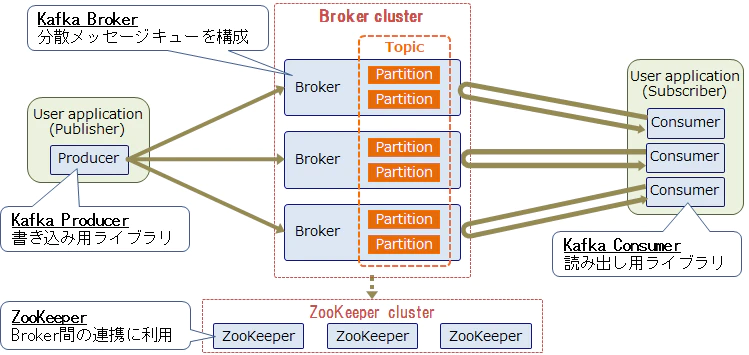
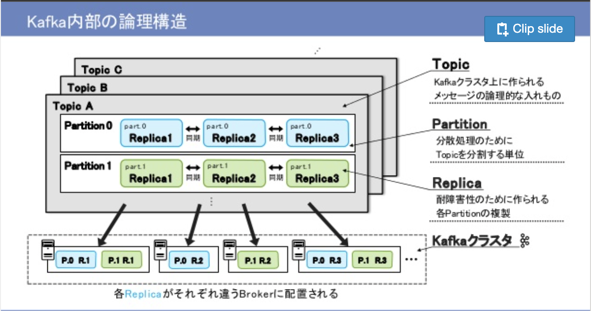

# Kafka

## 用語

|名前|役割|
|:---|:---|
|Kafka Cluster|Kafkaが実行されているサーバ(Broker)をグループ化したもの|
|Broker|Kafkaの単一サーバ|
|Zookeeper|Kafkaを管理するサーバ|
|Producer|Kafkaへメッセージを送信するアプリケーション|
|Consumer|Kafkaからメッセージを取得するアプリケーション|
|Topic|メッセージを整理するためのカテゴリー|
|Partition|Topic内のメッセージはパーティションという単位で分散させています|
|Replica|各Partitionは複数のBrokerに複製(Replica)されています|
|Leader|複製されているReplicaのうち唯一読み書きが許可されているReplica|
|Consumer Group|複数のConsumerを同一グループとして扱うためのもの。グループ化することで分散したConsumer間で同一メッセージを重複せずに読み込むことが可能です|
|Offset|Partition単位でメッセージをどこまで読んだか管理するためのもの|

## 全体像

 

## 設計

今回はサーバサイドとして Consumer で待ち受けるアプリを作る。

## 仕様メモ

### Consumer Group・追い越し

Kafka では Consumer がどこまでのメッセージを読み取ったかを `offset` 値として記録する仕組みがあります。メッセージ読み取り後にこの `offset` 値が自動で更新されるのですが、読み取ったメッセージを処理するまで `offset` 値を更新したいくないといような場合には、`enable.auto.commit` を `false` にすることで手動で `offset` 値を更新できます。デフォルトでは `true` に設定されているのが、一般的には、単純さよりも信頼性に重きが置かれる場合は `offset` を手動でコミットする `false` が最適です。

メッセージの読み取り位置である `offset` が記録されていない場合、`auto.offset.reset` 値に応じて `offset` が決まります。`auto.offset.reset` 値のデフォルトは `latest` となっていて、これは Consumer が接続後に送信されたメッセージから読み取ることを意味します。今回は `auto.offset.reset` 値に `earliest` を指定していて、Kafka サーバー上に残っている最も古いメッセージから読み取るようにしています。

Consumer は任意の数の Consumer インスタンスが属する Consumer Group という単位で管理されていて、この Consumer Group の識別子が `group.id` 値になります。メッセージの読み取り位置である `offset` もこの `group.id` に値毎に記録されます。

### メッセージ

Kafkaで交換されるデータのレコードの事です。
メッセージの中身に制限は特になく、テキストだけではなく画像ファイルのデータなどバイナリデータも入れることができその内容に制限はありません。
1メッセージの大きさは、デフォルトでは最大1MBになっていますが、拡張することができるのでサイズの大きな動画などでも入れることができますし。
JSONやAVROなどを利用することで、1つのメッセージに住所+名前といった複数項目の情報を入れることができます。

※ Kafkaではキー(key)値(value)といったフィールドが用意されておりどちらもバイナリデータを自由に入れることができます。

参考：http://mogile.web.fc2.com/kafka/documentation_5.html#messageformat